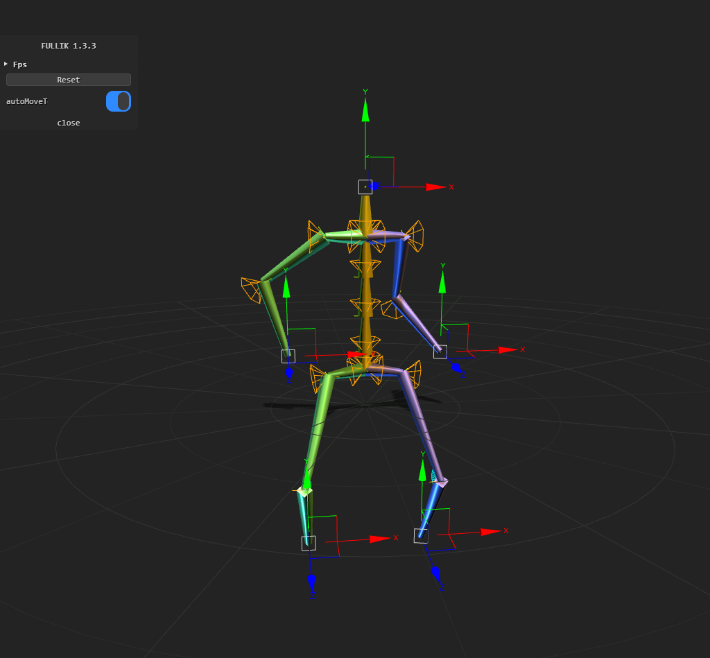

# Plant Form

The project is for **computation**, **display** and **simulation** of precious motion.

A simple demo is established

## Development Diary

-   2021-01-17

    -   Project initialization.

-   2021-01-18

    -   Trying to use fullik demo to do the inverse kinematic computation;
    -   The demos work fine in the django server.

-   2021-01-19
    -   Finish demo_0 in fullik demo, it is a move-able connected human bones.
